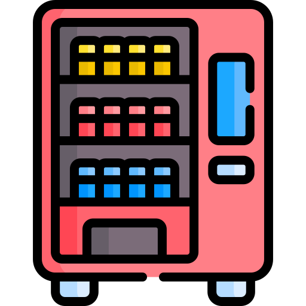
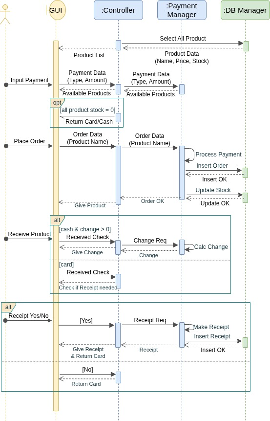
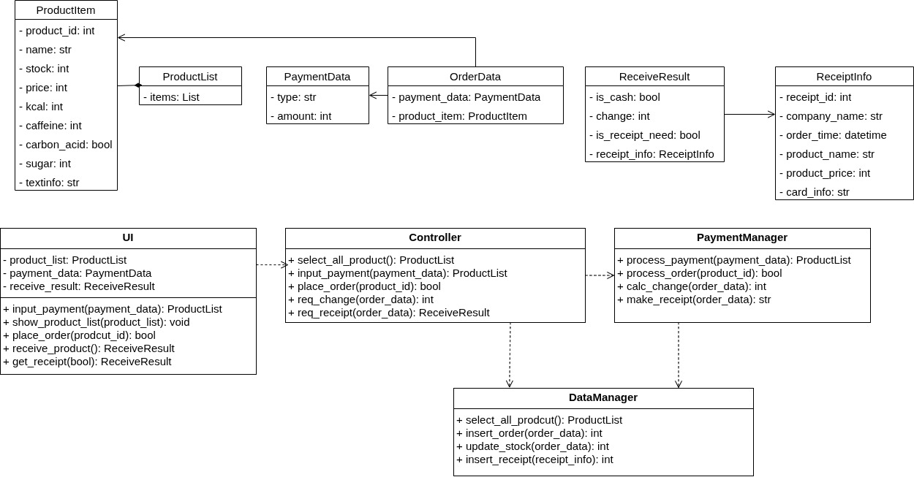
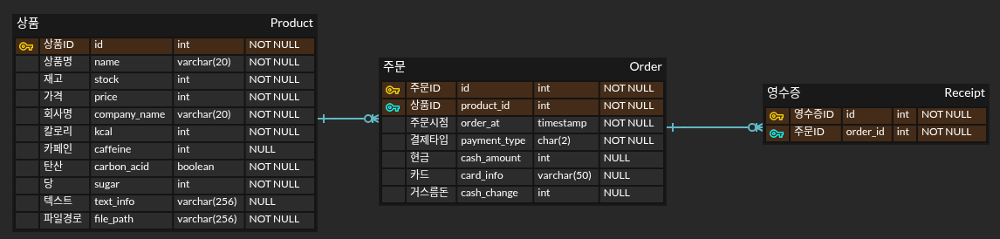

# 전지적 자판기 시점👀

## 소개
- 평범한 음료 자판기에 클라우드 기반 관리 기능 및 상품 안내 기능을 추가했습니다.
- AWS의 S3와 RDS를 사용하여 관리자/사용자에게 함께 보여야 할 데이터를 관리합니다.

## 디렉토리 구조
```
PBL_VENDING_MACHINE/
├── admin/         ← 관리자 웹 페이지
├── ai/            ← CCTV 
├── core/          ← 핵심 로직 (controller, payment_manager)
├── db/            ← DB 접근 로직 (db_manager)
├── tests/         ← 테스트용 코드
├── ui/            ← PyQt 기반 자판기 프론트엔드
├── main.py        ← 자판기(PyQt) 실행
├── README.md
└── requirements.txt
```

## 설계
- 시나리오: 고객이 음료 구매

- 클래스 다이어그램

- 데이터베이스 구조


## 개발 환경
|   |   |
|---|---|
|개발환경|     ||
|기술|     |


## 시연 영상

## 실행 방법
### 0. 외부 라이브러리 설치
```
pip install -r requirements.txt
```

### 1. 자판기
- 자판기이므로 IoT로 구현가능하도록 PyQt로 UI를 제작했습니다.
```
python3 main.py
```

### 2. 자판기 관리자 (웹페이지)
- 로컬호스트에서 실행할 수 있으며, 관리자가 PC에서 웹에 접속하는 화면을 염두에 두고 Flask를 사용하여 개발했습니다.
```
python3 admin/app.py
```

## 부가 기능: 이상행동 감지
- 자판기에 부착된 카메라가 있다고 가정하고, 자판기 근처에서 이상행동(쓰러짐, 폭력 등)이 있을 경우 파악하고자 했습니다.
- 개발 및 데모 영상 제작을 위해 UCF Crime Dataset을 사용했습니다.
- 현재 개발된 모델은 예측 정확도가 매우 낮으므로, 시각인공지능 학습 후 개선이 필요합니다.
